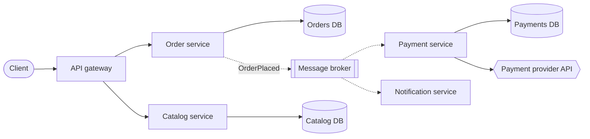

# CS 1: Microservice architecture

**Request:** "Architecture diagram for an order platform with services, a broker, and separate databases." (Components given by user.)
**Type:** architecture. Solid = synchronous request/response; dashed = asynchronous events. Each service owns its database (as stated).

**Checks:** sync vs async separated; stateful (cylinders) vs stateless; external service marked; no shared DB unless stated.
**Caption:** Microservice architecture of the order platform. Clients reach services through the API gateway (solid arrows, synchronous). Order placement is published to the broker (dashed, asynchronous) and consumed by the payment and notification services. Each service owns its database.
