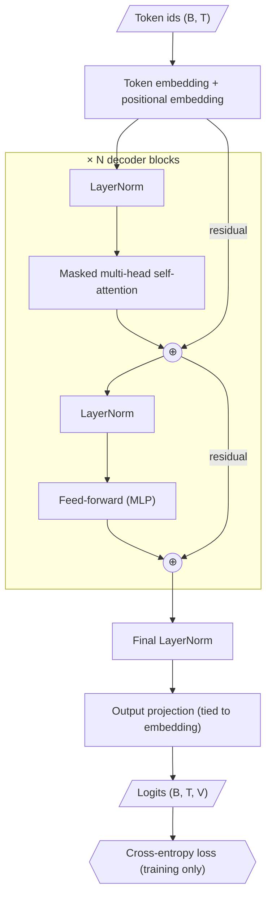

# CS 2: Transformer architecture figure

**Request:** "Turn this Transformer implementation into a model architecture figure." Source read first: pre-norm decoder-only, N blocks, learned positional embedding, tied output projection (given in the code the user supplied; if code is absent, mark as conceptual).
**Type:** model architecture, top-to-bottom, tensor path `(B,T,d)`.

**Checks:** residual paths drawn (into ⊕); pre-norm order matches code; loss marked training-only; inference replaces the loss with sampling. Bold/double borders for learned modules are recommended in the final style; positional encoding kind stated from the code.
**Caption:** Decoder-only Transformer. Token and positional embeddings feed $N$ identical pre-norm blocks, each with masked multi-head self-attention and a feed-forward network joined by residual connections (⊕). Final normalization and a projection tied to the embedding produce next-token logits; the loss is used only in training. Tensor shapes: batch $B$, length $T$, vocabulary $V$.
