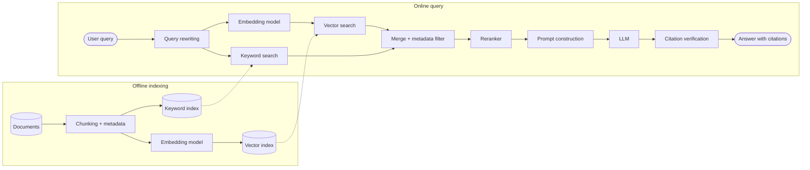

# CS 3: RAG architecture

**Request:** "RAG architecture with query rewriting, hybrid retrieval, reranking, and citation checking." (All four components requested, so all drawn.)
**Type:** two-lane data-flow diagram (offline indexing, online query).

**Checks:** the same embedding model used offline and online (state it); retrieval is read-only on indexes (dashed access); citation verification checks answer claims against retrieved passages; optional components labeled if not present.
**Caption:** Retrieval-augmented generation pipeline. Documents are chunked, embedded, and indexed offline (top). At query time the query is rewritten and used for hybrid (vector and keyword) retrieval; results are merged, filtered, reranked, and inserted into the prompt, and the generated answer is checked against the retrieved passages before it is returned.
