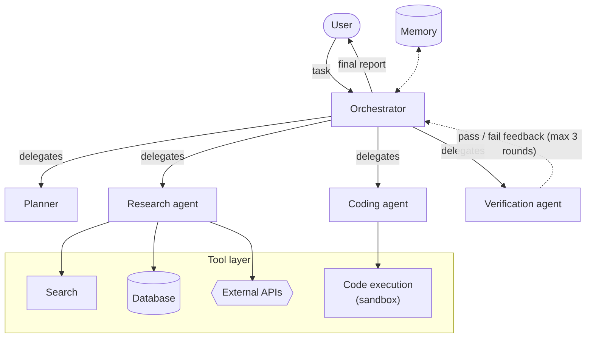

# CS 4: Agentic AI architecture (multi-agent research system)

**Request:** "Create an architecture diagram for this multi-agent research system." Inventory came from the user's description (orchestrator, planner, research, coding, verification agents; search, sandboxed code execution, database, external APIs; memory). Anything not on that list is not drawn.
**Type:** architecture with control (delegation) vs data edges.

Solid = delegation and results; dashed = feedback and memory access.
**Checks:** the loop has a stated bound; code runs only in the sandbox; who can call which tool is explicit (here: research → search/DB/APIs, coding → sandbox); human approval points not drawn because none were described (ask if any exist).
**Caption:** Multi-agent research system. The orchestrator decomposes the user's task and delegates to a planner and to research, coding, and verification agents, which access external capabilities through a common tool layer; code executes only inside a sandbox. The verification agent returns pass/fail feedback to the orchestrator for at most three rounds before the report is returned.
