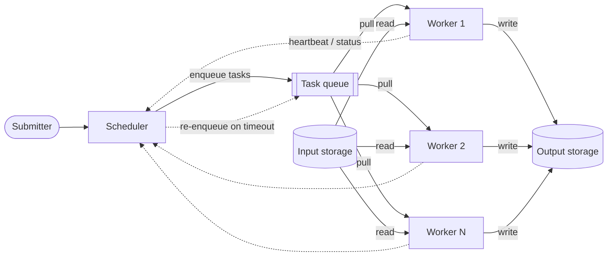

# CS 5: Distributed processing pipeline

**Request:** "Diagram our batch reconstruction pipeline: scheduler, workers, queue, shared storage."
**Type:** architecture / data flow, scientific-computing style. Assumption: a queue-based pull model with one scheduler (stated in the request).

**Checks:** control (enqueue, heartbeat) vs data (read/write) distinguished; workers stateless w.r.t. results (written to shared storage); retry path present; single scheduler = single point of failure - note if relevant.
**Caption:** Distributed batch-processing pipeline. The scheduler places tasks on a queue that workers pull from; workers read input data and write results to shared storage. Dashed arrows are control and monitoring traffic; tasks whose workers stop reporting are re-enqueued.
