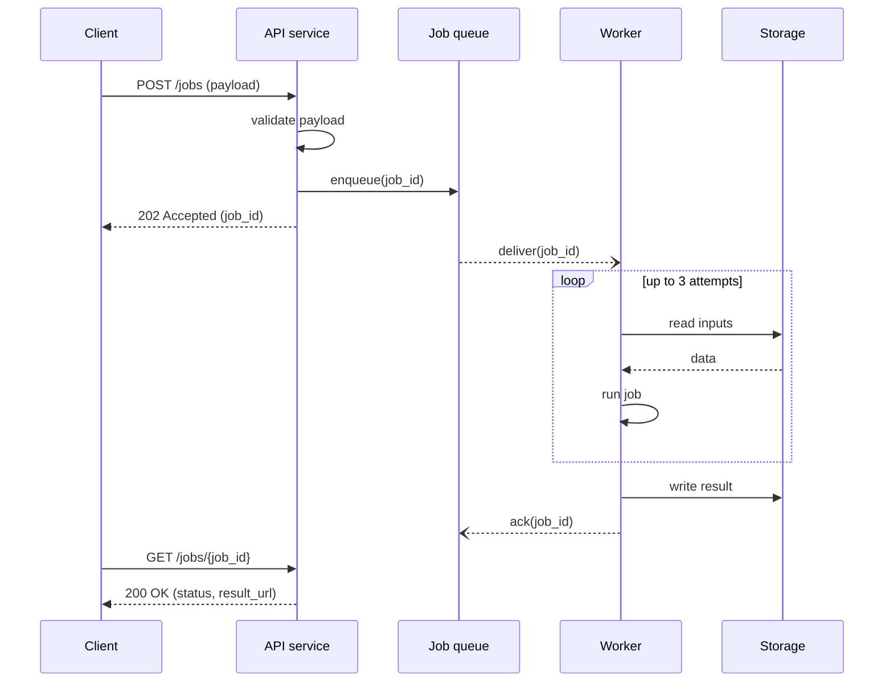

# CS 6: API sequence diagram

**Request:** "Sequence diagram: client requests a job, service validates, queues it, worker runs it, client polls." One scenario (happy path) plus one retry frame.
**Type:** sequence diagram. Solid = synchronous call, dashed = return, open head = asynchronous message.

**Checks:** async delivery (`--)`) vs synchronous calls; the 202 returns before the work happens; polling is a separate synchronous exchange; failure after 3 attempts is a different scenario (not drawn - add an `alt` frame if needed).
**Caption:** Message sequence for asynchronous job submission. The API acknowledges the request immediately (202) after enqueueing; a worker processes the job asynchronously, with up to three attempts, and stores the result, which the client retrieves by polling.
