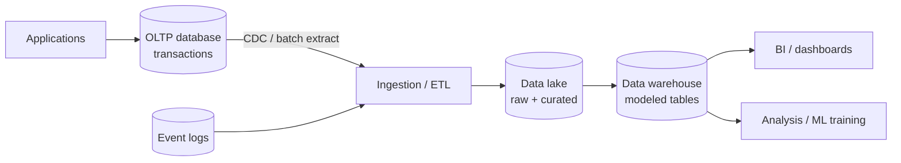

# CS 7: Database / data platform architecture

**Request:** "Show OLTP and OLAP separation with ETL, a lake, and a warehouse."
**Type:** data-platform architecture; arrows = data flow. Storage hierarchy conveyed by cylinders.

For an entity-relationship view of the OLTP schema use Mermaid `erDiagram` (see `references/mermaid-patterns.md`).
**Checks:** analytical queries do not hit OLTP; raw data retained in the lake (stated assumption); ETL vs streaming CDC labeled per the real system; indexes/partitioning are not shown at this level.
**Caption:** Data-platform architecture. Transactional workloads run against the OLTP database; extracted changes and event logs are ingested into a data lake and modeled into a warehouse, which serves dashboards and analysis workloads without loading the transactional system.
