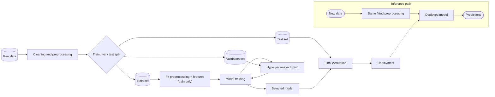

# CS 8: ML training pipeline

**Request:** "Draw the ML pipeline from raw data to deployment, with tuning."
**Type:** pipeline with training and inference paths separated; leakage-safe.

**Checks:** the split happens before fitting any data-dependent preprocessing; the test set is used once, after selection; validation feeds tuning only; inference reuses the *fitted* preprocessing.
**Caption:** Machine-learning pipeline. Data are split before any statistics are estimated; preprocessing and features are fitted on the training set only, hyperparameters are tuned on the validation set, and the selected model is evaluated once on the held-out test set before deployment. The inference path (bottom) applies the same fitted preprocessing to new data.
