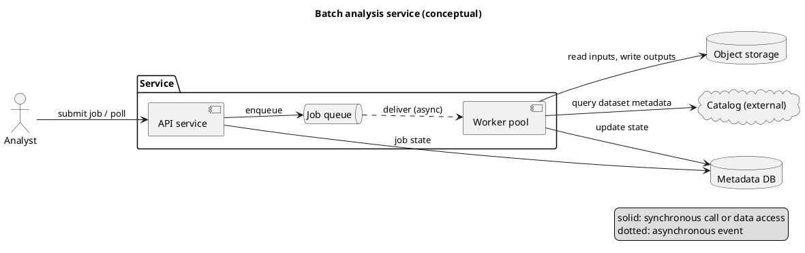

# CS 9: Component diagram in PlantUML

**Request:** "UML component diagram of the batch analysis service, for the software documentation."
**Type:** component diagram, technical level, PlantUML. Solid arrow = synchronous call or data access; dotted arrow = asynchronous event. Conceptual: a generic job-processing service, not a named codebase (label as such; if a repository is available, read it first).

**Checks:** every component is stated in the request or marked conceptual; the queue-to-worker link is the only asynchronous edge; storage is shown as stores, not services; the external catalog is drawn outside the service boundary. Rendered with PlantUML 1.2026.8 and inspected (2026-09-25).
**Caption:** Component view of the batch analysis service. Analysts submit and poll jobs through the API service, which records job state in the metadata database and enqueues work. Workers receive jobs asynchronously (dotted), read inputs from and write outputs to object storage, update job state, and query an external catalog for dataset metadata.
