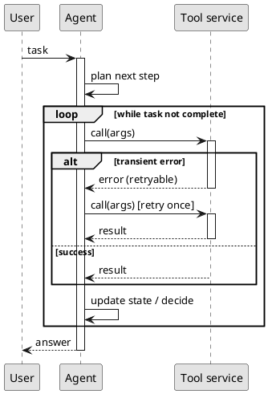

# CS 10: Sequence diagram in PlantUML (tool-call loop with retry)

**Request:** "Sequence diagram of an LLM agent calling a tool, with one retry on a transient error."
**Type:** sequence diagram, technical level, PlantUML. Solid arrow = synchronous call, dashed = return. One scenario (happy path plus a single retry frame); a permanent failure is a different scenario and is not drawn.

**Checks:** every `activate` has a matching `deactivate`; the `alt` branches are mutually exclusive; the retry happens once (stated); model calls inside "plan" and "decide" are self-messages, not separate participants (add an LLM participant if the model call must be visible). Rendered with PlantUML 1.2026.8 and inspected (2026-09-25).
**Caption:** Message sequence for an agent's tool-call loop. The agent repeatedly plans, calls a tool, and updates its state until the task is complete. A retryable error triggers one retry of the same call; the result then flows back to the agent, which returns the answer to the user.
