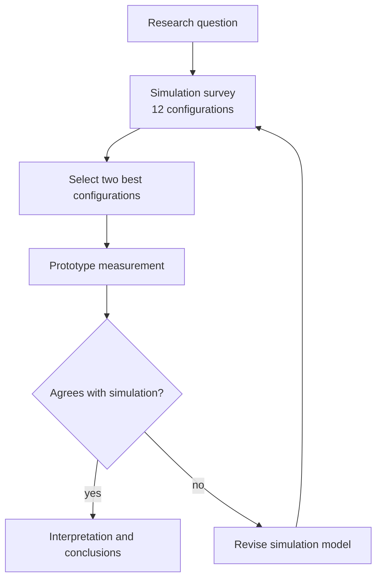

# General 1: Research workflow

**Request:** "Draw the workflow of our study from question to interpretation." Source: the Methods overview (question → survey of 12 detector configurations by simulation → selection of the best two → prototype measurement → comparison → conclusions).
**Type:** research workflow, top-to-bottom. Arrows = order and artifact dependence. Feedback shown only because the text says the comparison led to a second prototype round.

**Caption:** Study workflow. Candidate configurations are screened in simulation, the best two are built and measured, and the measurement is compared with the simulation; disagreement triggers revision of the simulation model before conclusions are drawn.
