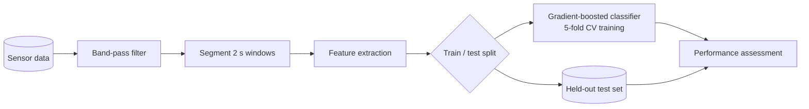

# General 2: Methodology pipeline from a Methods section

**Input text:** "Sensor data were band-pass filtered and segmented into 2 s windows. Features were extracted per window and a gradient-boosted classifier was trained with 5-fold cross-validation. Performance was assessed on a held-out test set."
**Type:** pipeline, LR, paper level. Only stated steps. Note: cross-validation is inside the training stage; the test set is separate.

**Ambiguity to flag:** the text does not say whether the split precedes feature extraction or windows from one recording can fall on both sides (leakage risk); the diagram places the split after extraction as written. Ask the authors.
**Caption:** Data-analysis pipeline. Filtered sensor signals are segmented and converted to features; a gradient-boosted classifier is trained with five-fold cross-validation and evaluated on a held-out test set.
