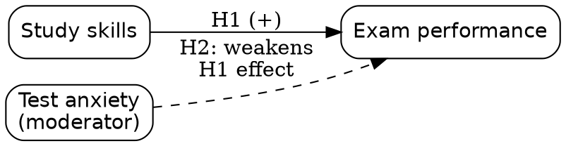

# General 3: Conceptual framework

**Request:** "Conceptual framework: study skills affect exam performance, moderated by anxiety." Only relationships stated; no causal claim beyond the authors' hypothesis.
**Type:** conceptual/hypothesis diagram, labeled hypothesized (H1, H2). Arrows = hypothesized influence, to be tested, not established causal effects.

**Note:** a moderator acts on the *relationship*; drawing the arrow to the edge (via an invisible midpoint) is the strict form in TikZ. If mediation was intended instead, the diagram changes.
**Caption:** Hypothesized framework. Study skills are expected to improve exam performance (H1), with test anxiety moderating the strength of this relationship (H2). Arrows denote hypotheses rather than established causal effects.
