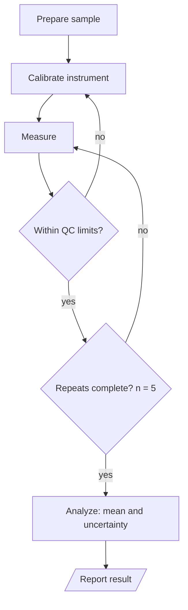

# General 4: Experimental workflow

**Request:** "Laboratory measurement workflow with calibration and repeats."
**Type:** experimental workflow with loops. Steps from the user's protocol only.

**Caption:** Measurement protocol. After calibration each measurement must pass quality-control limits, otherwise the instrument is recalibrated; five accepted repeats are averaged to obtain the result and its uncertainty.
