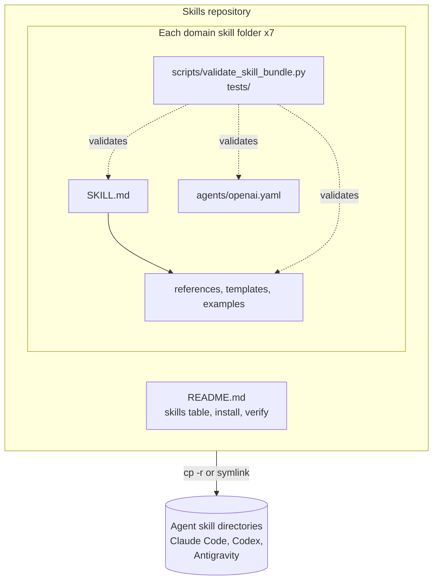

# General 5: Repository inspection -> architecture

**Request:** "Draw the architecture of this repository." The repository is the skills collection this skill lives in (`~/.agentic_ai_skills`). Source files were read first; only components found in them are drawn.
**Diagram type:** component / dependency diagram, technical level. Solid arrow = "is installed into / is read from", dashed = "is validated against". This is a structural diagram of files, not a runtime data flow.

**Workflow shown:** inspect -> component and connection tables with evidence -> diagram -> caption.

## Step 1 - what was read

`README.md` (skills table, Installation, "Verifying a skill bundle"), `<skill>/SKILL.md` (frontmatter and linked files), `<skill>/agents/openai.yaml` and `<skill>/scripts/validate_skill_bundle.py` (listing each skill folder), and the directory listing. Nothing was inferred from file names alone.

| id | component | kind | evidence |
|---|---|---|---|
| repo | Skills repository | container | top-level directory, `README.md` |
| skill | Domain skill folder (x7: agile-development, deep-learning, hep-analysis, ams-analysis, academic-papers, academic-diagrams, task-authoring) | content | `README.md` skills table |
| skillmd | `SKILL.md` + references/templates/examples | content | each skill folder |
| meta | `agents/openai.yaml` | metadata | each skill folder |
| val | `scripts/validate_skill_bundle.py` + `tests/` | verification | `README.md` "Verifying a skill bundle" |
| agents | Agent skill directories (`~/.claude/skills`, `~/.codex/skills`, `.agents/skills`, `~/.gemini/config/skills`) | external | `README.md` "Installation" |

| from | to | meaning | evidence |
|---|---|---|---|
| repo | agents | copied (`cp -r`) or symlinked into | `README.md` "Installation" (copy); `~/.claude/skills` entries are symlinks (observed) |
| val | skillmd / meta | checks presence and structure | `README.md` "Verifying a skill bundle" |

## Step 2 - diagram

**Validation:** every box maps to a file read in step 1; the seven skills are drawn as one repeated folder because they share the same layout, and no skill-to-skill edges are drawn because no skill imports or routes to another; symlinks and copies are one edge because the README documents copying and the symlinks are only an observation on one machine; no runtime (agent execution) behavior is drawn because none was inspected. Rendered with `mmdc`.
**Caption:** Structure of the skills repository. Each domain skill is a self-contained folder of instructions (`SKILL.md`), supporting material, agent metadata, and a validator with tests. The repository is copied or symlinked into an agent's skill directory. Solid arrows denote containment or installation; dashed arrows denote validation.
