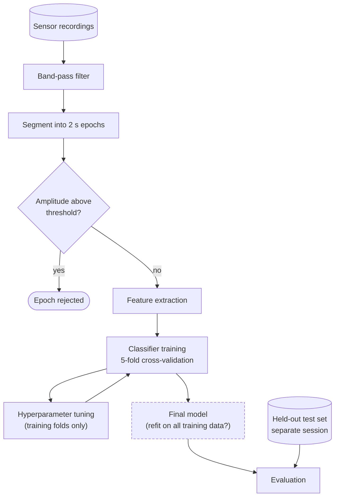

# General 6: Methods text -> workflow with the Known / Inferred / Assumed table

**Request:** "Turn this Methods paragraph into a workflow figure."
**Diagram type:** research-process workflow, paper level, top-to-bottom. Arrows = "output feeds the next step" (data dependency); a dashed arrow is a feedback/iteration.

**Source text (invented for this example, not from a real paper):**
> Sensor recordings were band-pass filtered and segmented into 2 s epochs. Epochs with amplitude above a fixed threshold were rejected. Features were extracted per epoch and a classifier was trained with five-fold cross-validation; hyperparameters were tuned on the training folds. The final model was evaluated on a held-out test set collected in a separate session.

## Step 1 - extraction, with the evidence tag on every item

| item | kind | status | basis |
|---|---|---|---|
| Sensor recordings | input | **Known** | "Sensor recordings" |
| Band-pass filter | process | **Known** | stated; cutoff frequencies not given - not drawn |
| Segmentation into 2 s epochs | process | **Known** | stated |
| Amplitude-threshold rejection | decision | **Known** | stated; threshold value not given |
| Feature extraction | process | **Known** | "Features were extracted" (which features unspecified) |
| Classifier training, 5-fold CV | process | **Known** | stated |
| Hyperparameter tuning inside training folds | process, loop | **Known** | "tuned on the training folds" |
| Held-out test set from a separate session | data + split | **Known** | stated |
| Final evaluation | process | **Known** | stated |
| Rejected epochs leave the pipeline | flow | **Inferred** | implied by "rejected"; reasonable, not stated |
| Refit on all training data before testing | process | **Assumed** | "the final model" implies one, but the text does not say it was refit; *ask the author or mark as assumption* |
| Evaluation metric | output | **Assumed** - not drawn | the text names none; the box says only "Evaluation" |

Rule applied: a step appears in the figure only if it is Known or Inferred. The Assumed refit step is drawn dashed with a `?` so a reader can see it is not from the text; the metric is left out.

## Step 2 - diagram

**Validation:** the test set enters only at evaluation (no leakage path drawn); tuning is inside the training folds; the test-set branch does not pass through the training-fold box; unspecified values (cutoffs, threshold, features, metric) are not invented. Note: whether the test set also goes through filtering and epoching is not stated - if it does, add that path (Inferred). Rendered with `mmdc`.
**Caption:** Analysis workflow. Recordings are band-pass filtered, segmented into 2 s epochs, and screened by an amplitude threshold before features are extracted. A classifier is trained with five-fold cross-validation, with hyperparameters tuned on the training folds only, and evaluated on a held-out test set from a separate session. The dashed box marks a step assumed by the figure rather than stated in the text.
