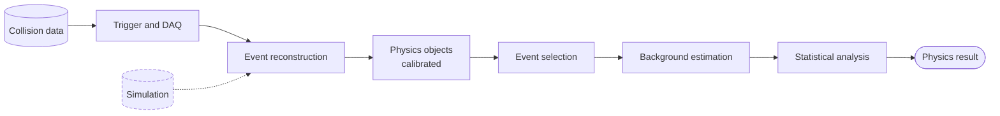

# HEP 1: Collider analysis pipeline (LHC-style)

**Request:** "Draw the event-processing pipeline for an LHC-style analysis."
**Diagram type:** analysis pipeline, paper level, left-to-right.

**Assumptions:** conceptual pipeline, not a specific experiment's software. Arrows = data flow.
Known: the user gave no experiment. Inferred: standard stages. Nothing experiment-specific drawn.

**Validation:** trigger before offline reconstruction; calibration before selection; data-driven
background from control regions (drawn in example 6); simulation enters reconstruction, dashed.
**Caption:** Overview of the analysis workflow. Collision events selected by the trigger are reconstructed into calibrated physics objects, filtered by the event selection, and combined with background estimates in the statistical analysis. Simulated events (dashed) follow the same reconstruction. Arrows denote data flow.
