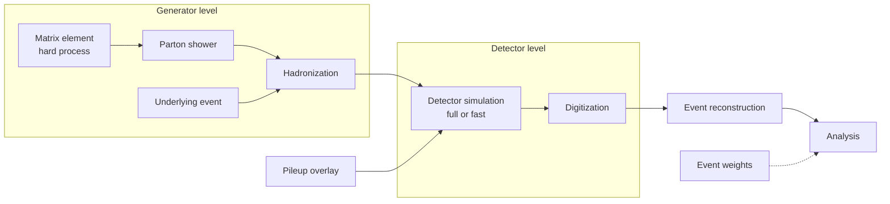

# HEP 2: Monte Carlo simulation chain

**Request:** "Show the simulation chain from physics process to analysis."
**Type:** pipeline with level annotations (truth / detector / reco).

**Notes:** full and fast simulation are *alternatives* for the DET box (state in caption).
Truth quantities do not enter selection; they are used for labeling/truth matching only.
Weights (generator, pileup, scale factors) attach to simulated events only.
**Caption:** Simulation chain. Hard-process events are showered and hadronized at generator level, overlaid with underlying-event and pileup activity, passed through detector simulation and digitization, and reconstructed with the same software as collision data. Full or fast simulation may be used for the detector step; event weights (dashed) are applied at the analysis stage.
