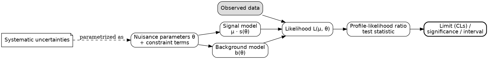

# HEP 4: Likelihood-analysis architecture

**Request:** "Draw the statistical analysis: signal, background, systematics to a limit."
**Type:** dependency graph (Graphviz). Frequentist profile-likelihood setting assumed (state it).

**Checks:** μ (parameter of interest) vs θ (nuisance); constraint terms attach to nuisances; correlations = shared θ, no arrows between systematics; Asimov/expected vs observed are separate branches (not drawn here); no Bayesian priors implied.
**Caption:** Structure of the likelihood analysis. The signal and background models depend on the signal strength μ and nuisance parameters θ that encode systematic uncertainties, and are confronted with the observed data in the likelihood. The profile-likelihood-ratio test statistic yields limits, significances, or confidence intervals on μ.
