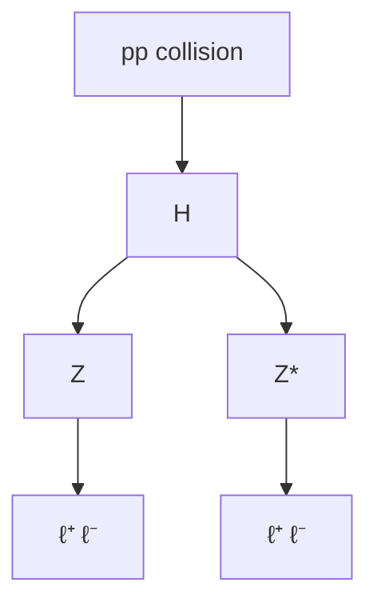
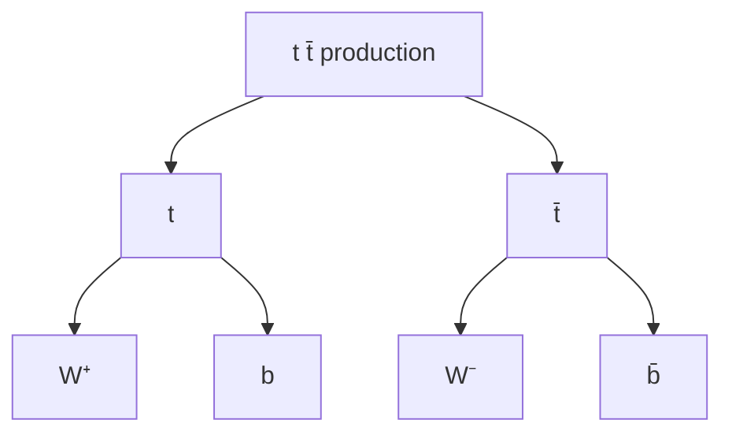

# HEP 5: Particle decay tree

**Request:** "Draw the decay chain pp → H → ZZ* → 4ℓ" and "t t̄ → W b W b̄".
**Type:** simplified decay tree (**not** a Feynman diagram). Assumption: SM decay topology; production mechanism (gluon fusion etc.) not specified so drawn as generic `pp`.

**Checks:** charge conserved at each node (t → W⁺ b, t̄ → W⁻ b̄; Z → ℓ⁺ℓ⁻); symmetric sides drawn symmetrically; "Z*" marks off-shell; lepton flavors of the two pairs are unspecified (same or different flavor) - say so.
**Caption:** Simplified decay topology for $pp\to H\to ZZ^{*}\to 4\ell$ (top) and top-quark pair decay (bottom). Boxes are particles or systems; arrows denote "decays to". This is not a Feynman diagram.
