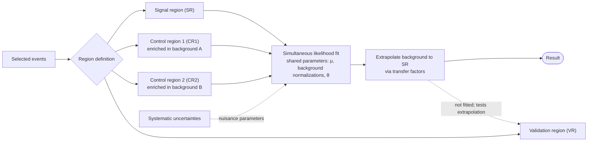

# HEP 6: Signal / control region workflow with simultaneous fit

**Request:** "Create a diagram showing signal regions, control regions, and a simultaneous likelihood fit."
**Type:** workflow + statistical architecture. Assumption: one signal region, two control regions, a validation region; user did not give numbers, so regions are generic.

**Checks:** regions are mutually exclusive selections; CRs constrain background normalization; VR is not in the fit (dashed check); SR data blinded until the fit is frozen (state if true); shared, not duplicated, parameters across regions.
**Caption:** Region-based analysis strategy. Events passing the preselection are divided into a signal region, two background-enriched control regions, and a validation region. The signal and control regions are fitted simultaneously with shared background normalizations and nuisance parameters; the validation region, which is not included in the fit, checks the background extrapolation.
