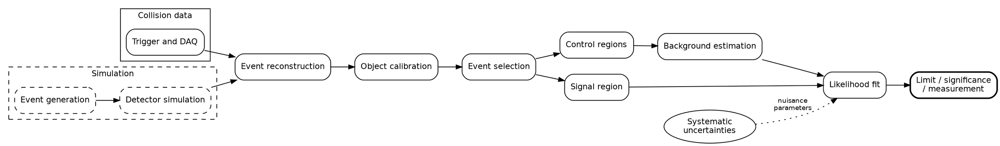
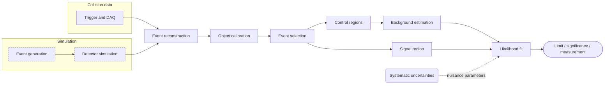
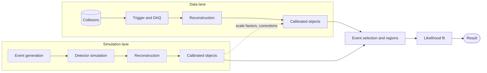

# HEP 8: LHC-style pipeline, three representations and a two-lane variant

**Request:** "Draw the event-processing pipeline for an LHC-style analysis" - primary output in Graphviz DOT, then the same graph as Mermaid and TikZ (multiple-representation mode), then a variant that separates data and simulation lanes.
**Diagram type:** analysis pipeline, paper level, left-to-right. Arrows = data flow; dashed nodes = simulation-only steps; dotted arrow = systematic-uncertainty input (nuisance parameters).

**Assumptions:** conceptual pipeline, not a specific experiment's software (Known: no experiment named; Inferred: the standard stages; Assumed: signal region is blinded until the background model is frozen). One logical graph, three renderings: node identity is the same in all of them (see the table).

| id | node | level | in data | in simulation |
|---|---|---|---|---|
| trg | Trigger and DAQ | detector | yes | (emulated) |
| gen | Event generation | generator / truth | - | yes |
| dsim | Detector simulation | detector | - | yes |
| rec | Event reconstruction | detector to objects | yes | yes |
| obj | Object calibration | reconstructed objects | yes | yes |
| sel | Event selection | analysis | yes | yes |
| cr / sr | Control / signal regions | analysis | yes | yes |
| bkg | Background estimation | analysis | yes | yes |
| fit | Likelihood fit | statistical | combined | combined |
| sys | Systematic uncertainties | statistical | - | - |

## 1. Graphviz DOT (primary; compiled with `dot`)



## 2. Mermaid (same graph, for README/docs)



## 3. TikZ (same graph, for the paper; not compiled here)

Packages: `tikz` with libraries `positioning, arrows.meta, fit, backgrounds`; engine pdfLaTeX or LuaLaTeX.

```latex
\tikzset{
  proc/.style = {draw, rounded corners=2pt, minimum height=7mm, align=center, font=\footnotesize},
  sim/.style  = {proc, dashed},
  flow/.style = {-{Stealth[length=2mm]}},
  syst/.style = {-{Stealth[length=2mm]}, dotted},
}
\begin{tikzpicture}[node distance=6mm and 7mm]
  \node[proc]              (trg) {Trigger\\and DAQ};
  \node[sim, below=of trg] (gen) {Event\\generation};
  \node[sim, right=of gen] (dsim){Detector\\simulation};
  \node[proc, right=of trg, xshift=18mm] (rec) {Event\\reconstruction};
  \node[proc, right=of rec] (obj) {Object\\calibration};
  \node[proc, right=of obj] (sel) {Event\\selection};
  \node[proc, above right=3mm and 8mm of sel] (sr) {Signal\\region};
  \node[proc, below right=3mm and 8mm of sel] (cr) {Control\\regions};
  \node[proc, right=of cr] (bkg) {Background\\estimation};
  \node[proc, right=of sr, xshift=16mm] (fit) {Likelihood\\fit};
  \node[proc, above=of fit] (sys) {Systematic\\uncertainties};
  \draw[flow] (trg) -- (rec);  \draw[flow] (gen) -- (dsim);  \draw[flow] (dsim) -| (rec);
  \draw[flow] (rec) -- (obj);  \draw[flow] (obj) -- (sel);
  \draw[flow] (sel) -- (sr);   \draw[flow] (sel) -- (cr);    \draw[flow] (cr) -- (bkg);
  \draw[flow] (sr) -- (fit);   \draw[flow] (bkg) -| (fit);
  \draw[syst] (sys) -- node[right, font=\scriptsize]{nuisance parameters} (fit);
\end{tikzpicture}
```
Absolute `xshift` values are layout guesses; compile and adjust, or switch to a matrix of nodes.

## 4. Variant: separate data and simulation lanes (Mermaid)

Use when the point is that the two lanes run the *same* reconstruction and merge only at the analysis level.



**Validation:** trigger precedes offline reconstruction; simulation goes through the *same* reconstruction (data-side trigger is emulated, not drawn); truth information does not reach selection; control regions feed the background estimate and both feed the fit; systematics enter as nuisance parameters, not as a processing step; the DOT graph was compiled, the Mermaid graphs were rendered with `mmdc`, the TikZ was not compiled. The dotted "scale factors" edge in the variant is a correction, not data flow - it is labeled for that reason.
**Caption:** Event-processing workflow of the analysis. Collision data (trigger, reconstruction) and simulated events (generation, detector simulation, dashed) are reconstructed and calibrated identically, then selected into signal and control regions. Control regions determine the background estimate; both enter the likelihood fit together with the systematic uncertainties (nuisance parameters, dotted). Arrows denote data flow.
