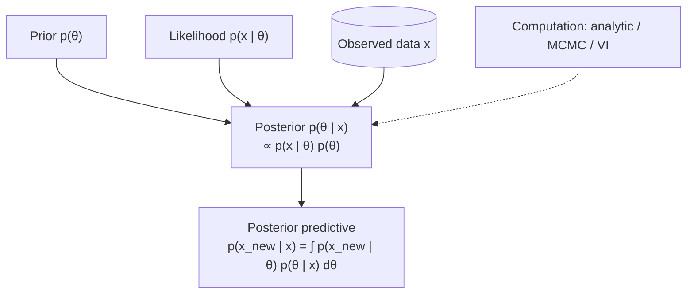

# Statistics 1: Bayesian inference workflow

**Request:** "Diagram the Bayesian workflow from prior to posterior predictive."
**Type:** inference workflow. Arrows = "is combined into / computed from". Data enters at the likelihood; the posterior is computed, not an input.

**Checks:** prior vs likelihood vs posterior placement; posterior is not called a "likelihood"; credible (not confidence) intervals come from the posterior.
**Caption:** Bayesian inference workflow. The prior and the likelihood of the observed data are combined by Bayes' theorem into the posterior, which is propagated to the posterior predictive distribution for new observations. The dashed box indicates that the posterior is evaluated numerically when no closed form exists.
