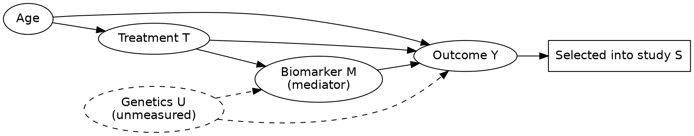

# Statistics 3: Causal DAG from stated assumptions

**Request:** "Create a causal DAG from these stated assumptions."
**Assumptions given (input):** Age affects both Treatment and Outcome. Treatment affects Outcome directly and through Biomarker. Unmeasured Genetics affects Biomarker and Outcome. Study selection depends on Outcome.
**Type:** causal DAG (assumptions supplied by the user).
**Only these edges are drawn.** Had no assumptions been given, the diagram would be labeled associational and the user asked for them.

**Reading (with the stated assumptions):** Age = confounder of T→Y (adjust); M = mediator (do not adjust for the total effect); Sel = descendant of Y (conditioning on it induces selection bias); U unmeasured and a common cause of M and Y, which makes the M→Y path confounded (relevant for mediation analysis). Missing edges (e.g. no Age→Biomarker) are claims of no direct effect.
**Caption:** Assumed causal structure. Arrows denote direct causal effects assumed by the authors; dashed elements are unmeasured. Age confounds the effect of treatment on outcome, the biomarker mediates part of the effect, and selection into the study is a consequence of the outcome.
