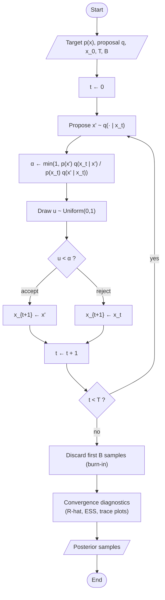

# Statistics 4: MCMC (Metropolis-Hastings) workflow

**Request:** "Convert this MCMC algorithm into a flowchart." (Algorithm: Metropolis-Hastings, T iterations, burn-in B.)
**Type:** algorithm flowchart with a loop; convergence diagnostics after the loop.

**Checks:** rejection *keeps* the current state (repeated sample), it does not resample; diagnostics use the collected chain(s), not a single step; Gibbs would have no accept/reject; HMC adds momentum + leapfrog before the accept step.
**Caption:** Metropolis-Hastings sampler. At each iteration a candidate is proposed and accepted with probability α; on rejection the chain repeats its current state. After T iterations the burn-in samples are discarded and convergence is assessed before the samples are used for inference.
