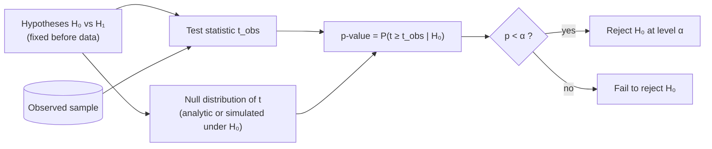

# Statistics 5: Frequentist hypothesis-testing pipeline

**Request:** "Draw the hypothesis test procedure."
**Type:** inference pipeline. Arrows = computation order. The null distribution is a distribution over *repeated samples under H₀*.

**Checks:** p-value is not P(H₀ | data); significance level α is chosen in advance; a confidence interval is a separate output of test inversion, not of this branch.
**Caption:** Hypothesis-testing procedure. The test statistic computed from the observed sample is compared with its distribution under the null hypothesis, giving a p-value that is compared with the pre-specified significance level α.
