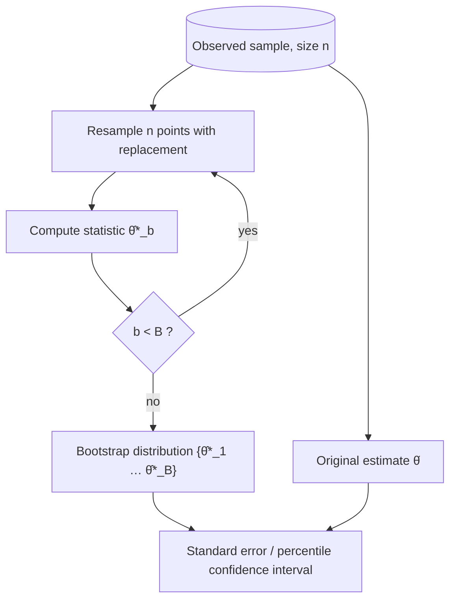

# Statistics 6: Bootstrap procedure

**Request:** "Show how we get a bootstrap confidence interval."
**Type:** resampling workflow with a loop over B replicates.

**Checks:** resampling unit matches data dependence (i.i.d. points; blocks for time series; clusters for grouped data - note if relevant); the interval is frequentist; permutation tests resample *labels without replacement* under H₀ (different diagram).
**Caption:** Nonparametric bootstrap. The observed sample is resampled with replacement B times, the statistic is recomputed on each replicate, and the resulting distribution provides a standard error or percentile interval for the original estimate.
