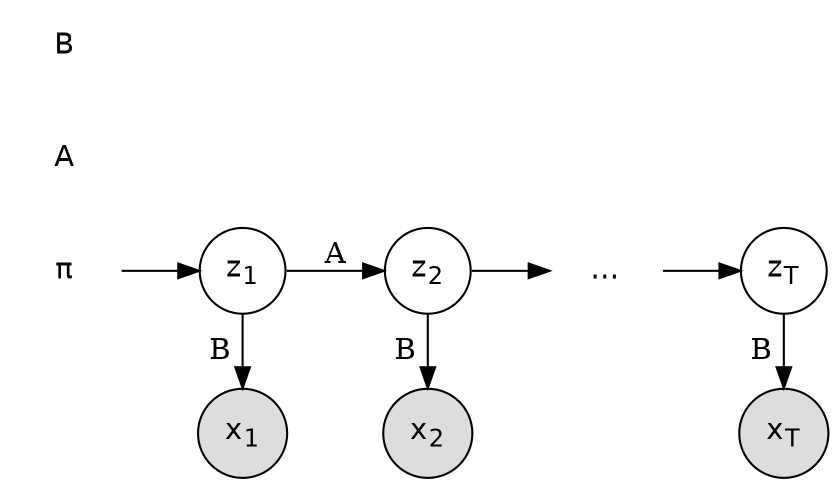

# Statistics 7: Hidden Markov model

**Request:** "Draw an HMM."
**Type:** dynamic Bayesian network (unrolled), T steps. Assumptions: first-order Markov states, emissions depend only on the current state. Edges = conditional dependence.

Model: $p(z_{1:T},x_{1:T})=p(z_1)\prod_{t=2}^{T}p(z_t\mid z_{t-1})\prod_{t=1}^{T}p(x_t\mid z_t)$, with initial distribution $\pi$, transition matrix $A$, emission model $B$.
**Checks:** shaded = observed, open = latent; parameters π, A, B are shared across t (noted; a plate over t is the compact alternative); no edge from x to z.
**Caption:** Hidden Markov model unrolled over $T$ time steps. Latent states $z_t$ (open) form a first-order Markov chain with transition matrix $A$; each observation $x_t$ (shaded) depends only on the current state through the emission model $B$.
