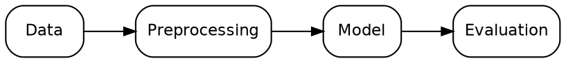
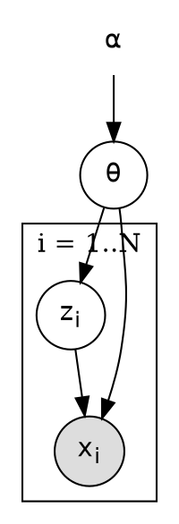

# Graphviz DOT Patterns

Best for dense directed graphs, dependency graphs, probabilistic graphical models, complex
workflows where automatic layered layout beats manual placement. Render: `dot -Tsvg f.dot -o f.svg`
(or `-Tpdf`). Engines: `dot` (layered/DAG), `neato`/`fdp` (undirected/force), `circo`, `twopi`.

## Baseline style



## Edge semantics

```text
    A -> B [label="data"];                       // solid  = data flow
    A -> C [style=dashed, label="control"];      // dashed = control flow
    A -> D [style=dotted, label="assumed"];      // dotted = assumed / optional
    A -> E [dir=both];                           // bidirectional
```

## Groups (clusters must be named `cluster_*`)

```text
subgraph cluster_sim { label="Simulation"; style=dashed; Gen; Geant; }
```

## Graphical model (Bayesian network with observed/latent nodes and a plate)


Conventions: filled = observed, unfilled = latent, plaintext = hyperparameter/fixed, `shape=doublecircle`
= deterministic (be consistent and legend it). The cluster box serves as the plate; put the index
range in its label. HTML-like labels (`<...>`) give subscripts/Greek via entities; true LaTeX needs
`dot2tex` or exporting to TikZ - state this dependency if used.

## Layout control

- `rank=same` to align: `{ rank=same; A; B; }`; `constraint=false` on an edge to keep it from
  affecting ranking (useful for feedback edges); `ordering=out` to preserve child order.
- Feedback loop: draw the back-edge with `constraint=false, style=dashed`.
- Invisible edges to force order: `A -> B [style=invis]`. Use sparingly.
- `splines=ortho` gives right-angle edges but drops edge labels in some versions - use `xlabel`.
- Long labels: manual line breaks `\n`; avoid wide nodes.

## Dependency graph (mathematical)

Nodes = quantities/functions, edge `A -> B` = "B depends on A" (state direction!). Keep DAG
acyclic; if a cycle is intended (fixed-point iteration) label it as iteration, not dependency.

## Pitfalls

- Cluster without the `cluster` prefix draws no box.
- Edges between clusters need `compound=true` and `lhead/ltail` to attach to the box.
- Unquoted ids with spaces or hyphens fail; quote them.
- The same layout may vary across Graphviz versions: pin the rendering in the paper repo (commit the SVG/PDF too).
- Graphviz cannot draw Feynman diagrams or exact plate rectangles around only some rank members reliably; if a plate must
  enclose nodes not adjacent in the layout, use TikZ.
