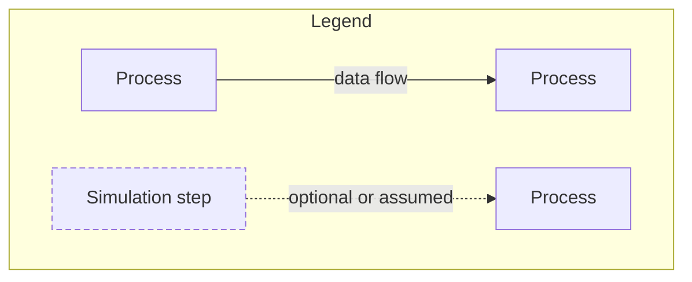
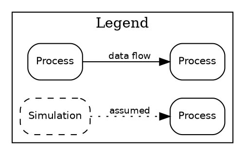

# Legends, Multi-Panel Figures, Talks, and Export

Covers the finishing work around a diagram: legends per format, multi-panel figures, posters and theses,
Beamer overlays and talk simplification, equation placement, the symbol table, and export recipes.

## 1. Legends

Add a legend whenever two or more edge or node styles coexist (solid = data flow, dashed = control or
simulation, dotted = assumed). One entry per style actually used; none for styles that do not appear.

**Mermaid** has no legend construct; draw one as a separate subgraph with unconnected sample nodes, or put the key in the caption.



**Graphviz**: a cluster of sample nodes; keep it out of the main rank with `rank=sink` or place it last.



**TikZ**: a small `matrix` or a `\node` with a `tabular`; reuse the same `\tikzset` styles as the figure so the key cannot drift.

```latex
\matrix[draw, row sep=1mm, column sep=3mm, font=\scriptsize, anchor=north west] at (current bounding box.north east) {
  \draw[flow] (0,0) -- (8mm,0); & \node[anchor=west]{data flow}; \\
  \draw[ctrl] (0,0) -- (8mm,0); & \node[anchor=west]{control flow}; \\
};
```

**SVG**: a `<g id="legend">` in the same file, using the same marker and dash attributes.
**Rule:** a legend that repeats a style the figure never uses is a bug; a style used but missing from the legend is also a bug.

## 2. Multi-panel figures

Use panels (a), (b), (c) when one figure would carry more than one message or more than ~12-15 nodes.

- One message per panel; the first panel is the overview, later panels zoom into one box of it.
- Same node vocabulary and styles in every panel; a node keeps its name and shape across panels.
- Mark the zoom relationship: the overview box that panel (b) expands gets a matching letter or a thick outline.
- Panel labels (a), (b) outside the content, in the same font, at a fixed corner; the caption describes each panel in order.
- Build each panel as its own source; compose in LaTeX (not by pasting sources into one graph):

```latex
\begin{figure*}[t]
  \centering
  \begin{subfigure}[t]{0.48\textwidth}\centering\includegraphics[width=\linewidth]{fig_overview.pdf}\caption{Analysis workflow}\end{subfigure}\hfill
  \begin{subfigure}[t]{0.48\textwidth}\centering\includegraphics[width=\linewidth]{fig_fit.pdf}\caption{Likelihood fit (zoom of the last stage)}\end{subfigure}
  \caption{...}
\end{figure*}
```
(needs `\usepackage{subcaption}`; venue classes may forbid it - follow the author kit.)

## 3. Posters and theses

| Target | Adjust |
|---|---|
| Poster | fewer nodes (<= ~8), larger text (readable at ~1.5 m), one figure per poster section, no legends longer than 3 entries |
| Thesis | one figure per concept, numbered by chapter, full detail allowed (technical level), a symbol table in the list of symbols, vector PDF at text width |
| Slides | see section 4 |

## 4. Beamer overlays and talk simplification

Simplify by **abstraction level** (see `general-diagram-principles.md` section 6), not by shrinking: keep node identity
so the audience can follow the paper figure. For a talk, reduce to <= ~7 boxes, labels <= 3 words, drop legends by using
one edge style, and reveal the pipeline one stage at a time.

Beamer with TikZ, reveal stage by stage using `\onslide` (no compile check was run here):

```latex
\begin{tikzpicture}[node distance=8mm]
  \node[proc] (a) {Trigger};
  \node[proc, right=of a, visible on=<2->] (b) {Reconstruction};
  \node[proc, right=of b, visible on=<3->] (c) {Selection};
  \draw[flow, visible on=<2->] (a) -- (b);
  \draw[flow, visible on=<3->] (b) -- (c);
\end{tikzpicture}
```
`visible on=<n->` needs `\usetikzlibrary{overlay-beamer-styles}`. Alternatives that avoid it: export one PDF per stage, or
`\only<n>{\includegraphics{...}}`. Keep positions fixed across overlays so nothing jumps.

## 5. Equation placement

- Put an equation **in a node** only when it *is* the object (e.g. a posterior `$p(\theta\mid x)$`); keep it to one short expression.
- Put an equation on an **edge label** when it defines the transformation (e.g. `$\theta\to\hat\theta$`), and prefer a symbol plus a definition in the caption over a long formula.
- Longer equations belong in the manuscript with a reference from the caption, not inside the figure.
- Mermaid renders KaTeX in labels only in some hosts; in DOT use HTML entities or plain text; TikZ takes LaTeX natively. State which is used.
- Use the same symbols as the paper (see the symbol table below).

## 6. Symbol table linking to the paper

Before drawing a model or statistical figure, write a table and keep it in the notes; reuse it for the caption and the paper.

| symbol in figure | meaning | paper definition (eq. / section, if known) | role |
|---|---|---|---|
| `\theta` | latent parameter | - (ask the author) | latent |

Never invent an equation number; leave "-" and flag it when the paper's numbering is unknown. If a figure symbol differs from the paper's, either rename the figure or add a one-line note, so the reader is never left to guess.

## 7. Export recipes

| Source | To SVG | To PDF | To PNG |
|---|---|---|---|
| Graphviz | `dot -Tsvg f.dot -o f.svg` | `dot -Tpdf f.dot -o f.pdf` | `dot -Tpng -Gdpi=300 f.dot -o f.png` |
| Mermaid | `mmdc -i f.mmd -o f.svg` | `mmdc -i f.mmd -o f.pdf -e pdf` | `mmdc -i f.mmd -o f.png -s 3` |
| SVG | - | `rsvg-convert -f pdf f.svg -o f.pdf` | `rsvg-convert -d 300 -p 300 f.svg -o f.png` |
| TikZ | via `dvisvgm` on the DVI or PDF | `\documentclass[tikz,border=2pt]{standalone}` + `pdflatex`/`lualatex` | `pdftoppm -r 300 -png f.pdf f` |

Prefer vector PDF for LaTeX manuscripts, SVG for web and editing, PNG only when a venue requires raster (>= 300 dpi at final size).
The Graphviz, `rsvg-convert`, and `mmdc` rows were run in this bundle's validation; the TikZ and `dvisvgm` rows were not.
Check text is still selectable after export (fonts embedded) and that the export did not change the layout.
