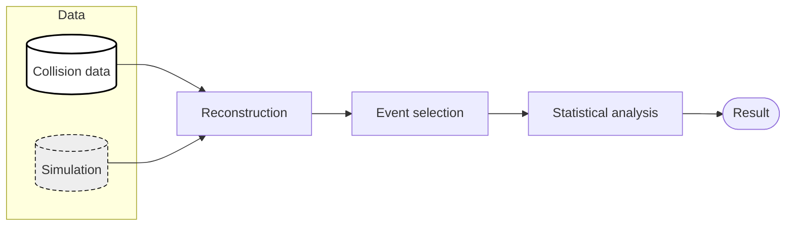
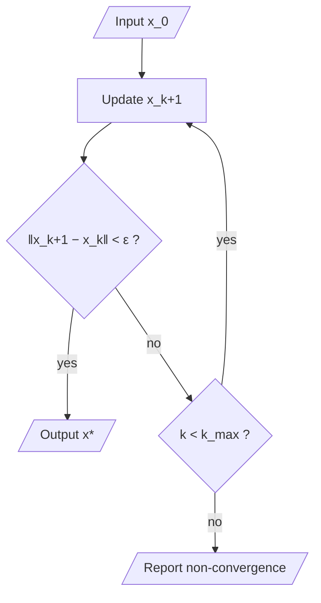
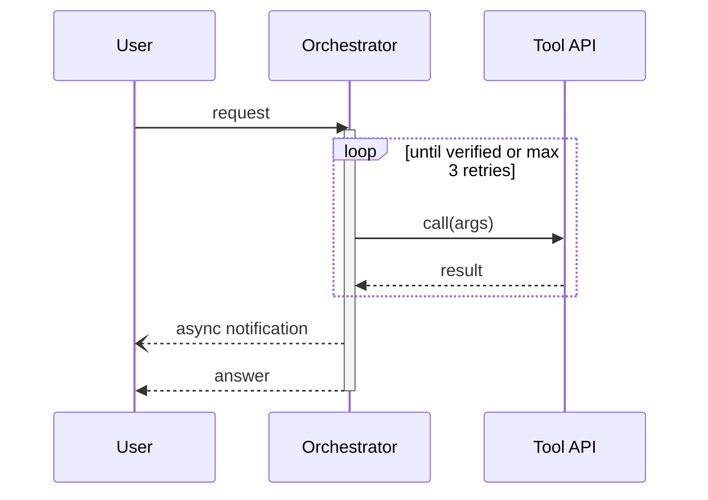
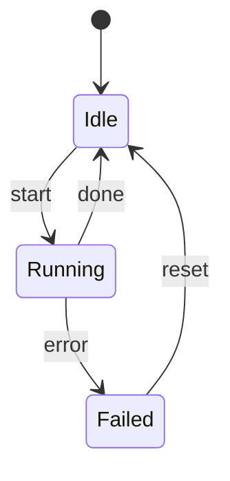
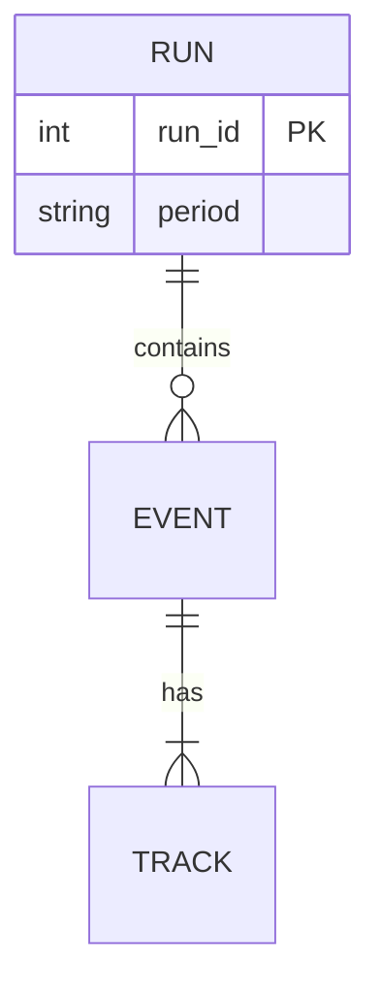

# Mermaid Patterns

Best for editable, GitHub/README-rendered flowcharts, pipelines, sequence and state diagrams.
Weak for: plates, precise layout control, Feynman diagrams, publication typography - use
Graphviz/TikZ for those. Syntax below is standard Mermaid; verify with a renderer
(`mmdc -i f.mmd -o f.svg`, or mermaid.live) since versions differ.

## Pipeline (LR) with groups and edge semantics


Use `classDef` with stroke style plus fill so it survives grayscale.

## Edge styles

```text
A --> B        solid arrow (data flow)
A -.-> B       dotted arrow (control / assumed / optional)
A ==> B        thick arrow (main path)
A -- label --> B     labeled edge     (also A -->|label| B)
A --- B        line without head
```
Declare in a legend subgraph or the caption: e.g. solid = data flow, dashed = control.

## Flowchart with decision and loop


Shapes: `[/ /]` parallelogram (I/O), `{ }` decision, `([ ])` terminator, `[[ ]]` subroutine, `[( )]` store.
Quote labels containing special characters or math-like text.

## Sequence


`->>` sync call, `-->>` return, `-)` / `--)` async. Frames: `loop`, `alt/else`, `opt`, `par/and`, `critical`, `Note over`.

## State



## ER



## Pitfalls

- Node ids with spaces/keywords (`end`, `graph`) break parsing; use short ids + quoted labels.
- Unbalanced quotes/brackets in labels; `;` and `#` in labels need quoting.
- No math typesetting by default (KaTeX support is renderer-dependent, `$$...$$`); keep math simple or use Graphviz/TikZ for LaTeX labels.
- Layout is automatic: long chains wrap unpredictably; use subgraphs and `direction` inside them, or switch tools when placement matters.
- Comments: `%% comment`. Keep the diagram source in the repo next to the paper.
- Mermaid has no plate notation or Feynman lines; do not fake them.

## Line breaks in labels

Use `<br/>` inside a quoted label (`A["Line one<br/>line two"]`); it is the most portable form. A literal `\n`
inside a quoted label also rendered as a line break in the Mermaid CLI used to validate this bundle, but support
varies by host (GitHub, Obsidian, older versions), so prefer `<br/>`. Unquoted labels with parentheses or `<`
need quotes.
