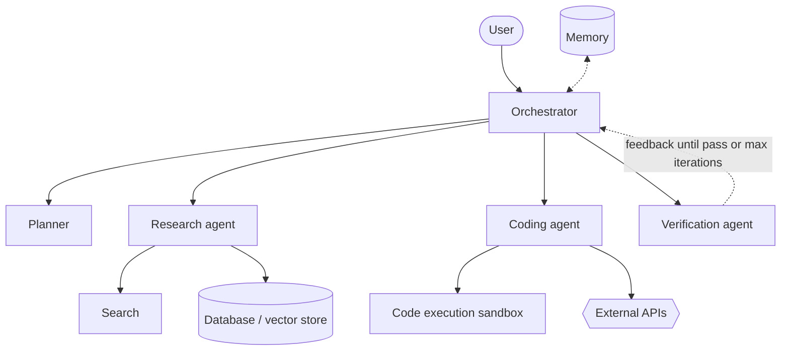

# Template: Agentic AI Architecture

**Use for:** multi-agent research systems, tool-using LLM agents, orchestrated workflows.
**Before drawing:** read the code/config/prompts that define agents, tools, memory, loops. Draw only what exists.

## Inventory

| element | present? (evidence) | notes |
|---|---|---|
| user / human-in-loop approval | | |
| orchestrator / planner / executor | | |
| specialist agents | | |
| memory (short-term, long-term) | | |
| tool layer (search, code, DB, APIs) | | |
| sandbox / trust boundary | | |
| verification / critic loop and stop condition | | |

## Mermaid skeleton

Solid = delegation and results; dashed = feedback / memory access. State this in the legend.

## Checks

Control (delegation) vs data (results) edges distinguished; every loop has a termination/iteration
limit; who may call which tool; trust boundary around code execution; approval points; no invented agents;
short-term context vs persistent memory not conflated.
