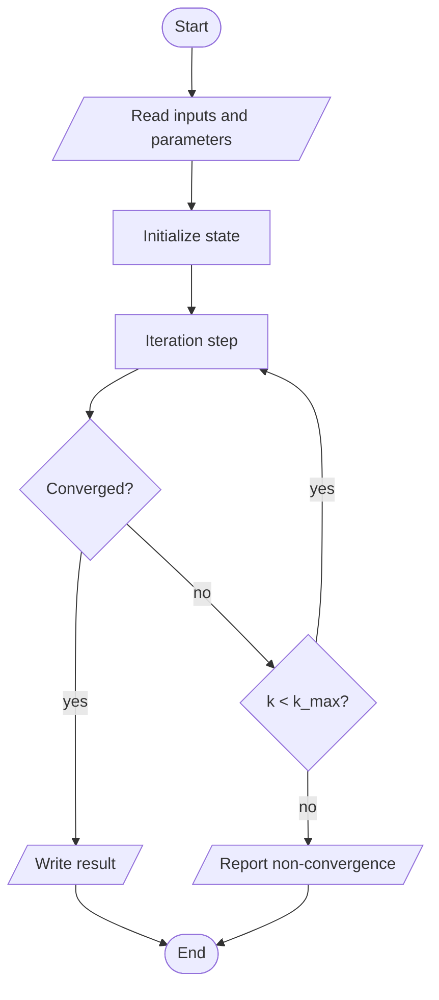

# Template: Algorithm Flowchart

**Use for:** pseudocode, source code, prose algorithm, Methods algorithm description.
**Edge semantics:** control flow (solid); data shown as I/O nodes.

## Extraction checklist

Inputs; outputs; initialization; each processing step; each condition (with both exits named);
loops (loop variable, update, **stopping criterion**, max-iteration guard); parallel branches
(fork/join); exceptions (distinct exit); subroutines (predefined-process boxes); termination.

## Shapes

Terminator = start/end; parallelogram = I/O; rectangle = process; diamond = decision (label every exit);
double-bar rectangle = subroutine; fork/join bar = parallel.

## Mermaid skeleton

## Checks

- Every decision has all exits labeled; no dead ends; exactly the terminators the algorithm has.
- Loop back-edge goes to the step that is re-executed, not to initialization unless it is.
- The flowchart follows the *code/pseudocode logic*, not paragraph order.
- Error handling shown only if present in the source.
- Big algorithms: overview flowchart + subroutine flowcharts.
