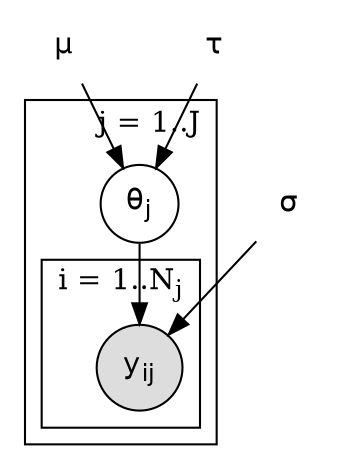
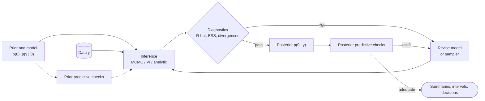

# Template: Bayesian Model

**Use for:** a Bayesian analysis whose figure must show *both* the generative model (variables, plates) *and* the inference procedure.
Use `probabilistic-graphical-model.md` when only the model graph is needed, and `../examples/statistics/04-mcmc-workflow.md` for the sampler.
**Assumption line:** edges in the model graph denote conditional dependence in the generative model, not causation; arrows in the workflow denote data flow.

## 1. Model specification (fill first)

| symbol | role | distribution / definition | plate | observed? |
|---|---|---|---|---|
| `\mu` | hyperparameter (fixed) | `\mathrm{const}` | - | fixed |
| `\theta_j` | latent parameter | `\theta_j \sim \mathcal N(\mu,\tau)` | j = 1..J | no |
| `y_{ij}` | data | `y_{ij} \sim \mathcal N(\theta_j,\sigma)` | i = 1..N_j | yes |

**Factorization** (the graph must match it exactly):
`p(y,\theta \mid \mu,\tau,\sigma) = \prod_j p(\theta_j \mid \mu,\tau) \prod_i p(y_{ij} \mid \theta_j,\sigma)`

## 2. Model graph (Graphviz; observed = filled, plates = clusters)

Plaintext symbols are fixed hyperparameters/constants. For exact plate boundaries or nested-plate typography use TikZ (`../references/tikz-patterns.md`).

## 3. Inference workflow (Mermaid)

## Checks

Shaded = observed only; each plate contains exactly the variables indexed by it; global parameters and hyperparameters
sit outside; priors are stated on every unobserved root; the posterior is computed, never an input; credible (not
confidence) intervals; prior sensitivity mentioned if the conclusion depends on the prior; any causal reading needs stated
assumptions (see `../examples/statistics/03-causal-dag.md`). Load `../references/probability-statistics.md`.
