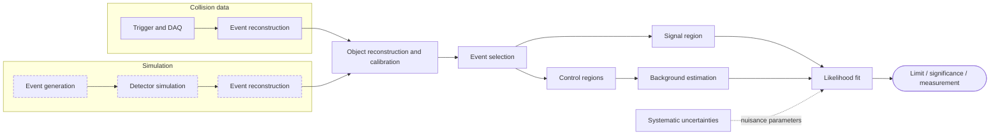

# Template: HEP Analysis Pipeline

**Use for:** collider analysis workflow, data + simulation chains, region-based analyses.
**Assumption line (always):** conceptual event-processing diagram, not a specific experiment's software.

## Levels to keep separate

| Level | Objects | Belongs to |
|---|---|---|
| generator / truth | partons, stable particles | simulation only |
| detector-level | hits, tracks, clusters | data and simulation |
| reconstructed objects | jets, e, mu, gamma, MET | data and simulation |
| analysis-level | selected events, regions, yields | data and simulation |
| statistical | likelihood, nuisances, results | combined |

## Mermaid skeleton

## Checks

Data vs simulation (dashed) merge only after the same reconstruction; truth not used in selection;
CR/SR/VR roles stated; systematics enter the fit as nuisance parameters, propagated from objects;
selection order physically sensible; blinding noted if SR data is used. Load
`../references/high-energy-physics.md`.
