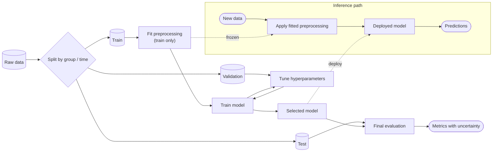

# Template: ML Pipeline

**Use for:** training and evaluation workflows, MLOps figures, experimental-setup schematics for a learned model.
**Assumption line (always):** conceptual pipeline; arrows are data flow; the training path and the inference path are drawn separately.
For the model *itself* (layers, attention) use the model-architecture guidance in `../references/computer-science.md`; for the PyTorch code use `deep-learning`.

## Stage table (fill before drawing)

| stage | input | output | fitted on | uses labels? | evidence |
|---|---|---|---|---|---|
| ingest / label | raw data | dataset | - | - | |
| split | dataset | train / val / test | - | - | |
| preprocess / features | train (fit), all (apply) | features | train only | no | |
| train | train features | model | train | yes | |
| tune | val features | hyperparameters | val | yes | |
| evaluate | test features | metrics | - (frozen) | yes | |
| deploy / infer | new data | predictions | - | no | |

## Mermaid skeleton

## Checks

Split precedes every data-dependent step and respects the leakage unit (group, subject, run, time) before any
preprocessing is fitted; validation tunes, test is used once; the inference path reuses the *fitted* preprocessing,
not a refit; labels appear only on the training side; augmentation applies to training data only; metrics carry
uncertainty or seeds if the paper claims a comparison. Also consider: pretraining vs fine-tuning as separate
lanes, human labeling as a loop, monitoring/drift as a dashed feedback from deployment.
