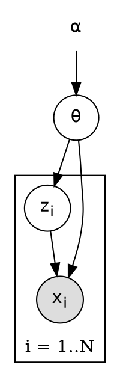

# Template: Probabilistic Graphical Model

**Use for:** Bayesian networks, hierarchical models, latent-variable models, HMMs, plate notation.
**Assumption line:** edges denote conditional dependence in the generative model, not causation.

## Variable table (fill before drawing)

| symbol | role (observed / latent / parameter / hyperparameter / deterministic) | distribution / definition | indexed by (plate) |
|---|---|---|---|

## Factorization (write it; the graph must match)

`p(\text{everything}) = \prod ...`

## Graphviz skeleton (observed = filled, latent = open, plate = cluster)

For nested plates and exact plate boundaries prefer TikZ (`fit` node; see `../references/tikz-patterns.md`).

## Checks

Shaded = observed only; plate contains exactly the indexed variables; global parameters outside;
priors on parameters; hyperparameters distinguished; d-separation statements you make are true in the
graph; if the user asks for causal reading, require stated assumptions.
