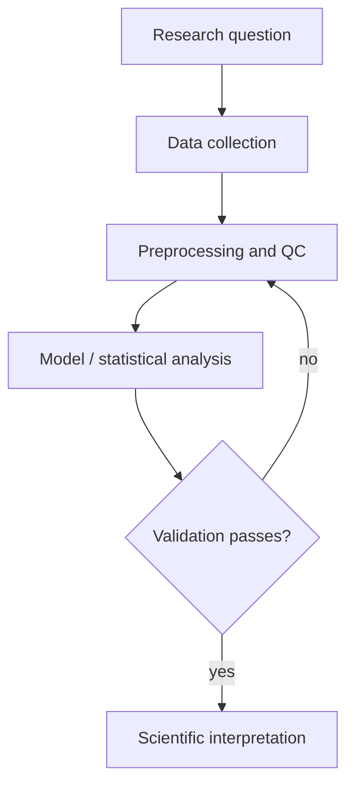

# Template: Research / Methodology Workflow

**Use for:** research workflow, experimental workflow, methodology overview, reproducibility pipeline.
**Edge semantics (declare):** temporal/dependency progression of stages; artifacts pass between stages.
**Layout:** top-to-bottom for a research process, left-to-right if it is a computational pipeline.

## Fill-in logical graph

| id | stage | input artifact | output artifact | status |
|---|---|---|---|---|
| S1 | Research question / hypothesis | - | question, hypotheses | known |
| S2 | Data collection / simulation | question | raw data | known |
| S3 | Preprocessing / quality control | raw data | clean data | known |
| S4 | Model / analysis | clean data | estimates, uncertainties | known |
| S5 | Validation | estimates | validation report | known |
| S6 | Interpretation | validation | conclusions | known |

Add: feedback edges only where the source states iteration (e.g. S5 -> S3 "revise"); mark any
inferred stage `inferred`.

## Mermaid skeleton

## Check before finalizing

- One message; stages named for what happens, not for paper section titles.
- Loops (V -> P) exist in the text, not invented.
- Validation is independent of data used to fit (no leakage) when the diagram implies it.
- Assumption line: "Arrows denote workflow order and artifact dependence."

## Caption seed

Overview of the <study> workflow, from <question> to <interpretation>. <Key artifact> passes ... ; the feedback arrow denotes ... .
