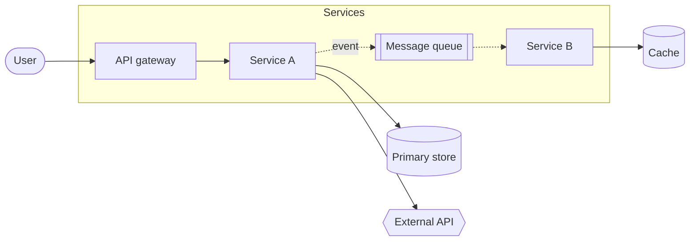

# Template: System Architecture

**Use for:** software, distributed, data-platform, DAQ, simulation-framework architectures.
**Before drawing:** inspect the repository (and measure, do not estimate, any count that goes into a label) (README, compose/Docker, manifests, configs, API specs, imports). List only components found or given.

## Component table

| id | component | kind (compute/storage/queue/external/human) | stateful? | local/remote | evidence (file/line or user text) |
|---|---|---|---|---|---|

## Connection table

| from | to | semantic (data/control/dependency/event) | sync/async | protocol/format | evidence |
|---|---|---|---|---|---|

## Mermaid skeleton

Solid = request/response or data; dashed = asynchronous events. Put this in the legend.

## Checks

data vs control flow; sync vs async; stateless vs stateful; local vs remote; persistent storage vs
cache; request-response vs event-driven; orchestration vs execution; no component without evidence
(or labeled "assumed").
Decompose into (a) overview, (b) data path, (c) deployment when > ~12 nodes.
